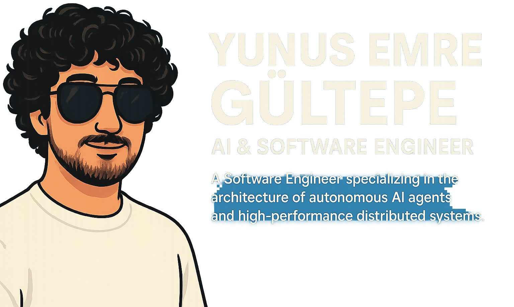

<!-- Banner Image -->

  

<!-- Introduction -->
<h1 align="center">Hi, I'm Yunus Emre Gültepe 👋</h1>

  AI Engineer building autonomous multi-agent systems and the production platforms that run them. At Ayasofyazilim, I lead development on Agent Hub (a multi-agent platform built on the Model Context Protocol) and our document-intelligence platform. Outside of work, I'm building Puzzlebop, a real-time multiplayer mobile game launching on Google Play. My work sits at the intersection of AI, backend architecture, and full-stack product engineering.

<!-- Social Links -->

  
  

### 🚀 Featured Projects

Here is a showcase of my work, from autonomous AI agents and real-time data pipelines to full-stack applications.

<table>
  <thead>
    <tr>
      <th width="60%">Project</th>
      <th width="40%">Core Technologies</th>
    </tr>
  </thead>
  <tbody>
    <tr>
      <td>
        <a href="https://github.com/Mordris/next-gen-support-agent-blueprint"><strong>Next-Gen Support Agent Blueprint</strong></a>
         
        <em>An end-to-end, self-correcting customer support agent that uses a reasoning loop (LangGraph), RAG, and intelligent tools to handle complex user queries.</em>
      </td>
      <td>
        
        
        
        
      </td>
    </tr>
    <tr>
      <td>
        <a href="https://github.com/Mordris/autonomous-sre-agent"><strong>AIDA - Autonomous Incident Diagnostic Agent</strong></a>
         
        <em>An end-to-end MLOps system for an autonomous SRE agent that diagnoses production alerts, learns from feedback, and improves over time via a fine-tuning pipeline.</em>
      </td>
      <td>
        
        
        
        
      </td>
    </tr>
    <tr>
      <td>
        <a href="https://github.com/Mordris/real-time-recommendation-engine"><strong>Nebula - Real-Time Recommendation Engine</strong></a>
         
        <em>A real-time recommendation engine that reacts to user interactions in seconds, using a stateful stream processor (Bytewax) and a large-scale vector database (Milvus).</em>
      </td>
      <td>
        
        
        
        
      </td>
    </tr>
    <tr>
      <td>
        <a href="https://github.com/Mordris/CodeScribe-AI-Agent"><strong>CodeScribe - AI Code Review Agent</strong></a>
         
        <em>An autonomous AI agent that integrates with GitHub to provide intelligent, RAG-powered code reviews and interactive refactoring suggestions on Pull Requests.</em>
      </td>
      <td>
        
        
        
        
      </td>
    </tr>
    <tr>
      <td>
        <a href="https://github.com/Mordris/fraud-detection-system"><strong>Real-Time Fraud Detection System</strong></a>
         
        <em>An end-to-end streaming data pipeline that uses Apache Flink and a stateful ML model to detect fraudulent transactions in real-time.</em>
      </td>
      <td>
        
        
        
        
      </td>
    </tr>
     <tr>
      <td>
        <a href="https://github.com/Mordris/fraud-detection-system-config"><strong>GitOps CI/CD Pipeline for Kubernetes</strong></a>
         
        <em>A complete GitOps workflow using Argo CD to manage the deployment of a microservices application onto Kubernetes with a multi-environment promotion strategy.</em>
      </td>
      <td>
        
        
        
         
      </td>
    </tr>
    <tr>
      <td>
        <a href="https://github.com/Mordris/AI-Powered-Automated-Attendance-System"><strong>AI-Powered Automated Attendance System (AttendAI)</strong></a>
         
        <em>A high-performance, distributed AI system for real-time facial recognition, featuring a full-stack observability dashboard.</em>
      </td>
      <td>
        
        
        
        
      </td>
    </tr>
    <tr>
      <td>
        <a href="https://github.com/Mordris/ai-chatbot-university-Thalassa"><strong>Sakarya University AI Chatbot (RAG System)</strong></a>
         
        <em>A research-oriented RAG chatbot built to provide accurate answers from a large, domain-specific knowledge base.</em>
      </td>
      <td>
        
        
        
        
      </td>
    </tr>
    <tr>
      <td>
        <a href="https://github.com/Mordris/LanDrop-file-transfer-over-network"><strong>LanDrop - Local Network File Transfer</strong></a>
         
        <em>A cross-platform desktop application for seamless file transfer over a LAN using Python sockets and Zeroconf for automatic device discovery.</em>
      </td>
      <td>
        
        
        
        
      </td>
    </tr>
  </tbody>
</table>

---

### 🛠️ My Core Tech Stack

-   **AI & Agents:** LangChain / LangGraph, Model Context Protocol (MCP), Microsoft Agent Framework, Microsoft Foundry, RAG, Vector Databases (Qdrant, FAISS), Local LLMs (Ollama)
-   **Backend:** Python (FastAPI), .NET (ABP Framework), Node.js (Fastify), PostgreSQL, Redis, ClickHouse
-   **Frontend & Mobile:** TypeScript, React.js, Next.js, React Native (Expo)
-   **DevOps & Cloud:** Docker, CI/CD (GitHub Actions), Prometheus / Grafana, Azure (Azure OpenAI), Cloudflare
